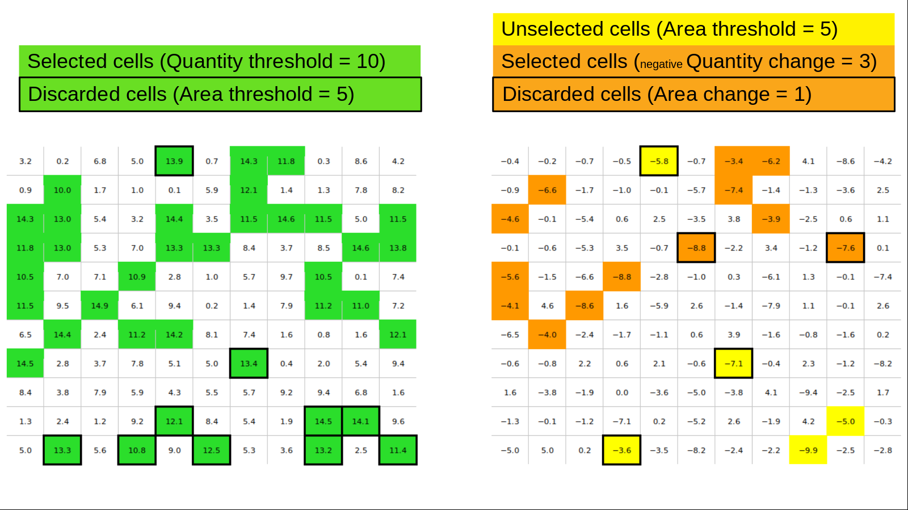
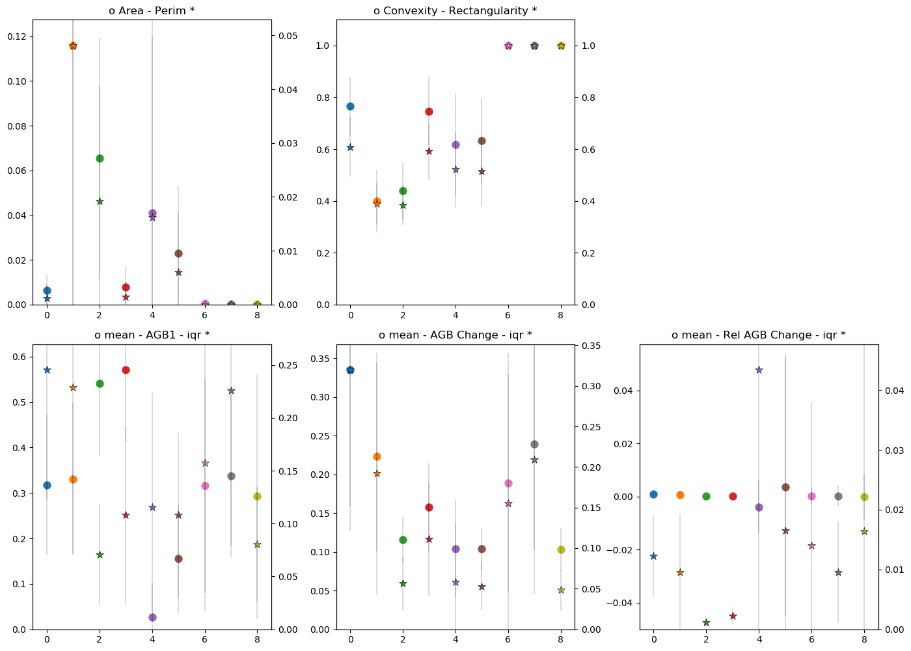
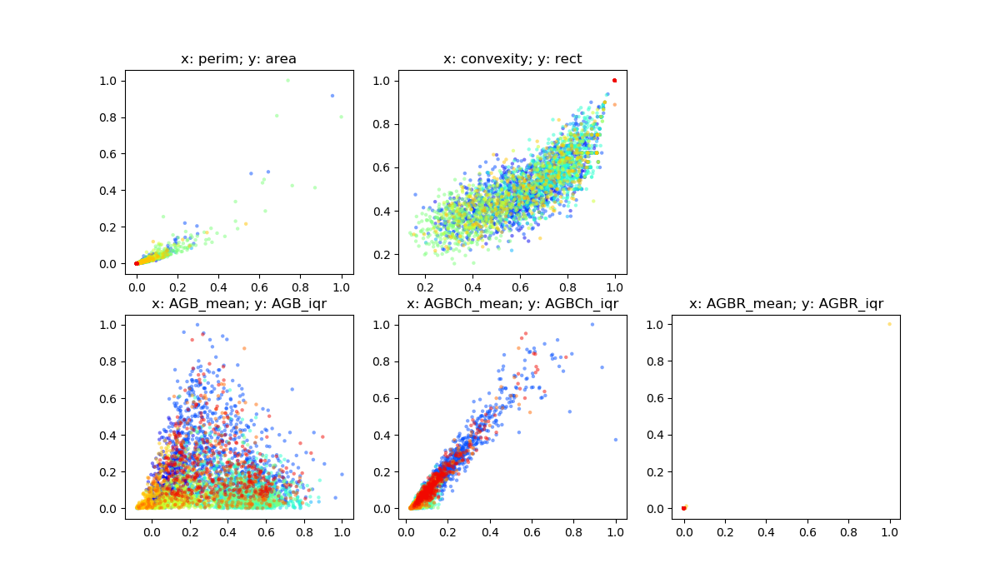
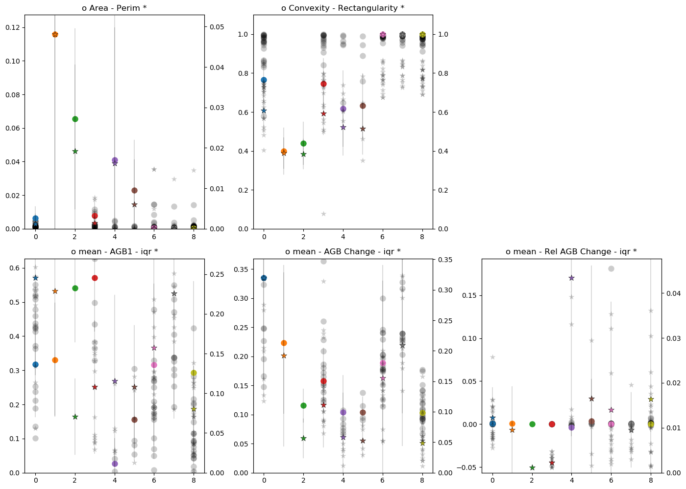
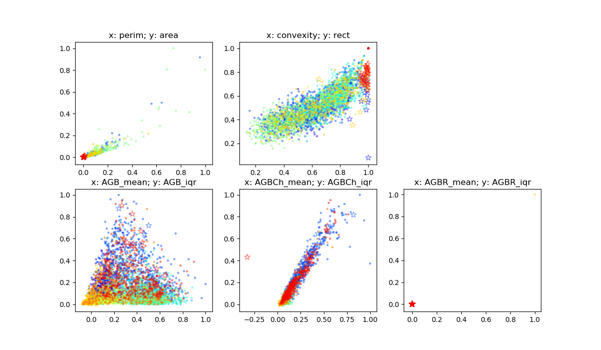

How does acacia work?
===========================

Making polygons
--------

``acacia`` takes values from both input rasters to make polygons of change. In the figure below, the square on the left represents the initial data, and the square on the right represents the change data. If the value of cells in the initial data exceed 10 (Quantity threshold), the cells are selected. However, if less than 5 contiguous cells are selected (Area threshold), then the cells will be discarded. Likewise, if the value of the cells in the change data are high than -3 (Change threshold) and the cells were originally selected in the initial data, then the cells are selected. If less than 2 contiguous cells are selected (Area change), the remaining cell is discarded.
The final selected cells are grouped to form polygons (3 polygons in the example below). Each polygon will be given a set of properties based on the boxes you ticked before running the script.

Making clusters
--------

``acacia`` uses a hierarchical clustering method. Based on the properties you selected, it will build a distance matrix between all the polygons It will then select a separation distance to determine between 5 and 10 classes of polygon while ensuring maximum separation between the classes using the ` Davies-Bouldin index <https://en.wikipedia.org/wiki/Davies–Bouldin_index>`_ .

The figures below show examples of clusters and their properties

Using your field data
--------

``acacia`` offers the possibility to compare your field data to the data from remote sensing. If you have entered a file for validation data, then ``acacia`` will extract properties from your data and compare it to the polygons. It will then fit your data in the most likely class.

The figures below show examples of clusters and their properties compared to field data.

