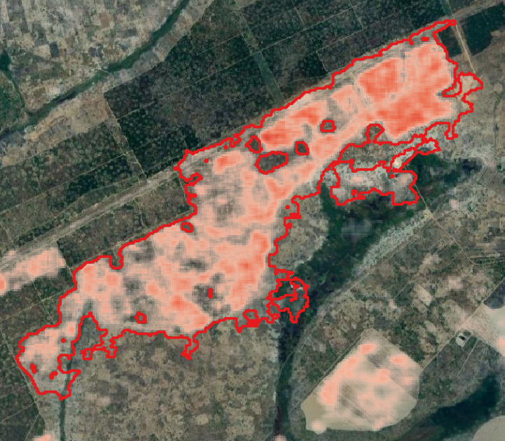
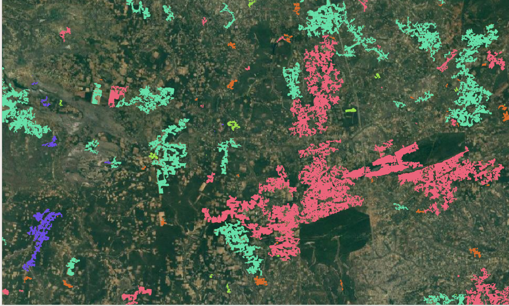

Worked example 
======================================================

In this worked example we will try out ``acacia`` on merged tiles of biomass and biomass change in North-West Zambia. These files are located in the ``data/`` folder by default.

Preparation
-----------

First ensure that you’ve followed the setup instructions successfully.

Open a terminal, and use ``cd`` to navigate to the location where you've stored ``acacia``. Then open the GUI as shown below:

.. code-block:: console

    cd /path/to/acacia/
   python Acacia.py

You should now see the ``acacia`` window on your screen.' By leaving all your parameters by default, you will obtain about 100 classified polygons. You can then load these polygons into QGIS and check the values of change within them, as shown below:

You can also visualise the clusters by choosing a classified colour scheme for the polygons according to the field 'cluster'.

You should see something like this (but not exactly this, the subsampling is random).

.. NOTE::
    ``acacia`` subsamples the polygons of change by default to avoid crashing your computer. If you are confident your machine can take it, increase the number of elements into the thousands!
